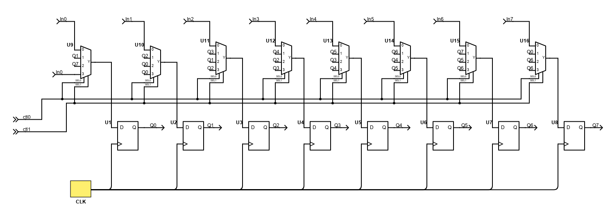

[](https://opensource.org/licenses/Apache-2.0) [](https://github.com/efabless/caravel_project_example/actions/workflows/user_project_ci.yml) [](https://github.com/efabless/caravel_project_example/actions/workflows/caravel_build.yml)

# Universal shift register (8-bit)

## Design details:
- Implements an universal shift register to perform various operation
- The design is written in verilog using structural model
- With the current implementation the design performs the following operations based on a control input:
   - Parallel Load
   - Right shift
   - Left shift
   - Serial-In


## Block Diagram




## Operation Table

| ctl-bit 0 | ctl-bit 1 | OPERATION   |
|-----------|-----------|-------------|
|     0     |     0     |   LOAD      |
|     0     |     1     | RIGHT SHIFT |
|     1     |     0     | LEFT SHIFT  |
|     1     |     1     | SERIAL-IN   |

# Steps to Use the design

## Dependencies
```
sudo apt-get update
sudo apt-get install git
sudo apt-get install yosys
sudo apt-get install docker
git clone https://github.com/subash92-16/universal_shift_register.git
```

## setting up the environment
```
cd universal_shift_register
make setup
```

## Full chip simulation
```
make simenv
make verify-all-rtl
```

## Hardening the design using openlane
```
make harden
```

## clean 
```
cd universal_shift_register
make clean
make clean-user_project_wrapper
make clean-user_proj_example
```


Refer to [README](docs/source/index.rst#section-quickstart) for a quickstart of how to use caravel_user_project

Refer to [README](docs/source/index.rst) for this sample project documentation. 
